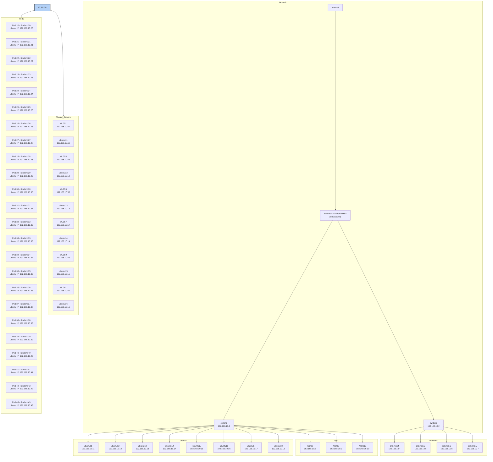
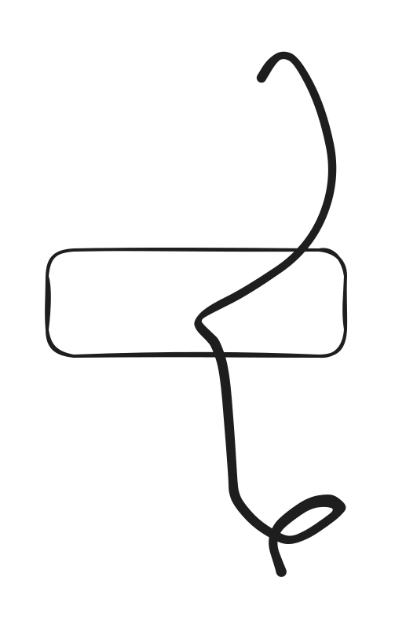

# Topology

```mermaid
graph TD
    subgraph Network
        Internet[Internet]
        RouterFW[Router/FW Meraki MX64
                 192.168.10.1]
        switch2[switch2
                192.168.10.2]
        switch3[switch3
                192.168.10.3]
        Internet --> RouterFW
        RouterFW --> switch2
        RouterFW --> switch3
    end

    subgraph Proxmox
        proxmox4[proxmox4
                 192.168.10.4]
        proxmox5[proxmox5
                 192.168.10.5]
        proxmox6[proxmox6
                 192.168.10.6]
        proxmox7[proxmox7
                 192.168.10.7]
        switch2 --> proxmox4
        switch2 --> proxmox5
        switch2 --> proxmox6
        switch2 --> proxmox7
    end

    subgraph WLC
        wlc8[WLC8
             192.168.10.8]
        wlc9[WLC9
             192.168.10.9]
        wlc10[WLC10
              192.168.10.10]
        switch3 --> wlc8
        switch3 --> wlc9
        switch3 --> wlc10
    end

    subgraph Ubuntu
        ubuntu11[ubuntu11
                 192.168.10.11]
        ubuntu12[ubuntu12
                 192.168.10.12]
        ubuntu13[ubuntu13
                 192.168.10.13]
        ubuntu14[ubuntu14
                 192.168.10.14]
        ubuntu15[ubuntu15
                 192.168.10.15]
        ubuntu16[ubuntu16
                 192.168.10.16]
        ubuntu17[ubuntu17
                 192.168.10.17]
        ubuntu18[ubuntu18
                 192.168.10.18]
        switch3 --> ubuntu11
        switch3 --> ubuntu12
        switch3 --> ubuntu13
        switch3 --> ubuntu14
        switch3 --> ubuntu15
        switch3 --> ubuntu16
        switch3 --> ubuntu17
        switch3 --> ubuntu18
    end

    classDef vlan10 fill:#b3d1f7,stroke:#333,stroke-width:2px;
    vlan10[VLAN 10]:::vlan10

    subgraph Shared_Servers
        wlc51[WLC51
              192.168.10.51]
        ubuntu11s[ubuntu11
                  192.168.10.11]
        wlc53[WLC53
              192.168.10.53]
        ubuntu12s[ubuntu12
                  192.168.10.12]
        wlc55[WLC55
              192.168.10.55]
        ubuntu13s[ubuntu13
                  192.168.10.13]
        wlc57[WLC57
              192.168.10.57]
        ubuntu14s[ubuntu14
                  192.168.10.14]
        wlc59[WLC59
              192.168.10.59]
        ubuntu15s[ubuntu15
                  192.168.10.15]
        wlc61[WLC61
              192.168.10.61]
        ubuntu16s[ubuntu16
                  192.168.10.16]
    end

    subgraph Pods
        Pod20[Pod 20 - Student 20
              Ubuntu IP: 192.168.10.20]
        Pod21[Pod 21 - Student 21
              Ubuntu IP: 192.168.10.21]
        Pod22[Pod 22 - Student 22
              Ubuntu IP: 192.168.10.22]
        Pod23[Pod 23 - Student 23
              Ubuntu IP: 192.168.10.23]
        Pod24[Pod 24 - Student 24
              Ubuntu IP: 192.168.10.24]
        Pod25[Pod 25 - Student 25
              Ubuntu IP: 192.168.10.25]
        Pod26[Pod 26 - Student 26
              Ubuntu IP: 192.168.10.26]
        Pod27[Pod 27 - Student 27
              Ubuntu IP: 192.168.10.27]
        Pod28[Pod 28 - Student 28
              Ubuntu IP: 192.168.10.28]
        Pod29[Pod 29 - Student 29
              Ubuntu IP: 192.168.10.29]
        Pod30[Pod 30 - Student 30
              Ubuntu IP: 192.168.10.30]
        Pod31[Pod 31 - Student 31
              Ubuntu IP: 192.168.10.31]
        Pod32[Pod 32 - Student 32
              Ubuntu IP: 192.168.10.32]
        Pod33[Pod 33 - Student 33
              Ubuntu IP: 192.168.10.33]
        Pod34[Pod 34 - Student 34
              Ubuntu IP: 192.168.10.34]
        Pod35[Pod 35 - Student 35
              Ubuntu IP: 192.168.10.35]
        Pod36[Pod 36 - Student 36
              Ubuntu IP: 192.168.10.36]
        Pod37[Pod 37 - Student 37
              Ubuntu IP: 192.168.10.37]
        Pod38[Pod 38 - Student 38
              Ubuntu IP: 192.168.10.38]
        Pod39[Pod 39 - Student 39
              Ubuntu IP: 192.168.10.39]
        Pod40[Pod 40 - Student 40
              Ubuntu IP: 192.168.10.40]
        Pod41[Pod 41 - Student 41
              Ubuntu IP: 192.168.10.41]
        Pod42[Pod 42 - Student 42
              Ubuntu IP: 192.168.10.42]
        Pod43[Pod 43 - Student 43
              Ubuntu IP: 192.168.10.43]
    end

    vlan10 --> Shared_Servers
    vlan10 --> Pods

```

